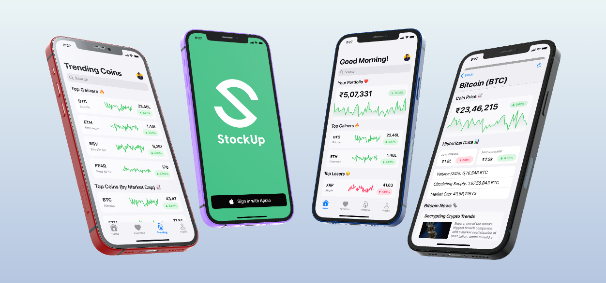

## StockUp

StockUp is the one app to rule all your cryptos!

Check current market data, manage your portfolio and view news about crypto around the world.

## Project Status

`Completed ✅`

StockUp is a UI Prototype, and not a functioning app. 

Please view my repo [StockUp-App](https://github.com/ts1506/StockUp-App) for status about the app.

## Plugins and Tools

StockUp is created using Figma. The primary UI design targets iOS devices. The following plugins/libraries have been used:

- [Datavizer](https://www.figma.com/community/plugin/736737028247625415/Datavizer) by [Amelia Wattenberger](https://www.figma.com/@wattenberger)
- [iOS/iPad OS 13 Design UI Kit](https://www.figma.com/community/file/768365747273056340) by [Juan Arreguin](https://www.figma.com/@juanarreguin)
- [iOS 14 UI Kit For Figma](https://www.figma.com/community/file/858143367356468985) by [Joey Banks](https://www.figma.com/@joey)
- [SF Symbols 3 for Figma](https://www.figma.com/community/file/886999666531731323) by [Uladzislau Lochkouski](https://www.figma.com/@vladlucha)
- [Social Login Buttons](https://www.figma.com/community/file/945702178038082375) by [Dakota Reid](https://www.figma.com/@dakoda)

Note: Charts and Data inside the mockup is fictional. Real Market Data has not been used.

## How to Use

- Download and install Figma on your machine
- Clone the repository to your local system
- Open Figma and Select New -> Import
- Import the Project from `Projects\StockUp.fig`
- To Prototype, click the Run icon inside Figma

Note: You may need to install `Apple SF Pro Font` on your Macbook. Fonts will need substitution for running on Windows.

## Other Resources

- [Previewed.app](https://previewed.app) - For Banner Design
- [Figma](https://www.figma.com) - For UX Design + Prototyping
- [Adobe Photoshop](https://www.adobe.com/in/products/photoshop.html) - For Icon Design
- [Apple SF Pro Font](https://developer.apple.com/fonts/) - In-App Fonts